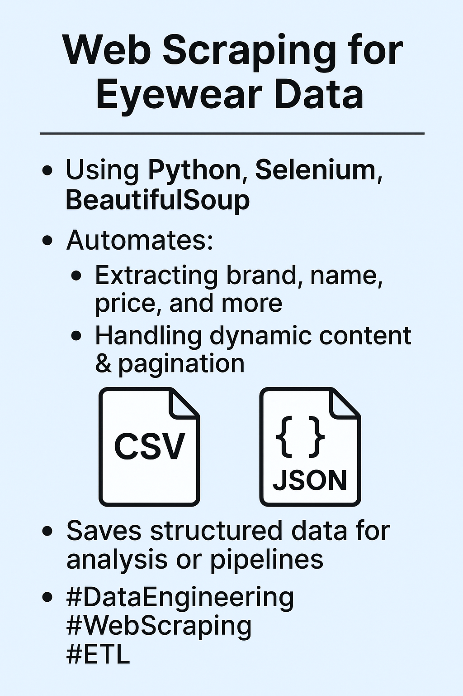

# Glasses-data-automation
A python-based project that automates the collection of prescription glasses data from e-commerce sites.

## Glasses and Frames Web Scraping Project 👓

### Introduction
This project is a collection of **Python-based web scrapers** built with **Selenium** and **BeautifulSoup** to extract structured product data from two leading eyewear retail websites:  
- [Glasses.com](https://www.glasses.com)  
- [FramesDirect.com](https://www.framesdirect.com)  

The scrapers automate the collection of product details (brand, model, prices, discounts, badges, categories) into **CSV** and **JSON** formats, making the data available for analysis, reporting, and downstream data engineering workflows.
## Tech Stack
Python 3.9+

Selenium
 – browser automation

BeautifulSoup
 – HTML parsing

webdriver-manager
 – ChromeDriver auto-install

CSV and JSON – structured data export

## Features
- **Dynamic Page Handling**: Uses Selenium to render JavaScript-heavy pages.  
- **BeautifulSoup Parsing**: Extracts structured data from raw HTML.  
- **Pagination Support**: Iterates through multiple product pages for full coverage.  
- **Data Cleaning**: Converts string prices like `$189.00` into numeric floats (e.g., `189.0`).  
- **Resilient Selectors**: Handles variations in HTML structure across pages.  
- **Multi-Script Support**: Separate scrapers for single-price, dual-price (former/current), and paginated data.  
- **Export Options**: Saves datasets into CSV and JSON files.

## Project Structure

```bash

 glasses.py   # Glasses.com scraper (former & current prices + discounts)
  glasses_single.py #Glasses.com scraper (single-price version + badges)
 framesdirect.py # FramesDirect.com scraper
 glasses_pag.py   # Glasses.com scraper with pagination
 framesdirect_pag.py # FramesDirect.com scraper with pagination
 data/   # Exported CSV and JSON files
 README.md    # Project documentation
 ```
 ## Scripts Overview
glasses.py - 
Extracts former price, current price, and discounts.
Saves data into CSV/JSON.

glasses_single.py - 
Handles the single-price format (current Glasses.com structure).
Captures badges like Best Seller and Sustainable.

framesdirect.py - 
Extracts brand, model, prices, and discounts from FramesDirect.com.

glasses_pag.py - 
Scrapes all product pages from Glasses.com.
Automatically follows pagination links.

framesdirect_pag.py - Pagination-enabled scraper for FramesDirect.com.
Ensures complete dataset coverage.
## Data Fields Extracted

Depending on the script, the following fields are captured:

Brand: Eyewear brand (e.g., Ray-Ban, Oakley).

Product_Name: Model name or product code.

Former_Price: Original retail price (if available).

Current_Price: Offer or discounted price (if available).

Price: (single-price version only).

Discount: Discount percentage (when available).

Badge_First / Badge_Second: Marketing badges (e.g., Best Seller, Sustainable).
## Sample output(CSV)
Brand,Product_Name,Price,Badge_First,Badge_Second,Category
Ray-Ban,RB4194,176.0,,,"Prescription Eyeglasses and Frames"
Oakley,OX8178 Rafter,172.0,Sustainable,,Prescription Eyeglasses and Frames
Scuderia Ferrari,FZ6006,132.0,Best Seller,,Prescription Eyeglasses and Frames
## Json
[
  {
    "Brand": "Ray-Ban",
    "Product_Name": "RB4194",
    "Price": 176.0,
    "Badge_First": null,
    "Badge_Second": null,
    "Category": "Prescription Eyeglasses and Frames"
  },
  {
    "Brand": "Oakley",
    "Product_Name": "OX8178 Rafter",
    "Price": 172.0,
    "Badge_First": "Sustainable",
    "Badge_Second": null,
    "Category": "Prescription Eyeglasses and Frames"
  }
]
 ## NOTE:
 Respect the websites’ terms of service before deploying at scale.


## Challenges Encountered and Solutions Implemented

### Dynamic Content Loading

Challenge: Unlike static websites, FramesDirect loads many products dynamically as the user scrolls. Without handling this, only a limited number of products were captured.

Solution: I implemented a scrolling loop in Selenium to simulate user scrolling, ensuring that lazy-loaded products appeared in the DOM before parsing.

### Delayed Page Readiness

Challenge: Parsing the page source immediately after loading sometimes resulted in missing elements.

Solution: I used WebDriverWait with document.readyState to ensure the page was fully loaded before extraction began.

### Inconsistent HTML Structure

Challenge: Different products displayed prices using slightly different HTML classes, making extraction unreliable if only one selector was used.

Solution:I wote helper functions (first_text_bs) that tried multiple CSS selectors until a valid value was found. This made the scraper more robust against structural variations.

### Extracting Numeric Prices

Challenge: Prices were displayed as formatted strings (e.g., "$176.00"). These needed to be converted into numeric values for analysis.

Solution: I created a to_float helper function that used regex to extract numeric values, cleaned commas, and converted text into floats.

### Cleaning Discount Labels

Challenge: Discounts were displayed as "30% Off", but the requirement was to save only "30%".

Solution: I implemented a clean_discount function that removed the word “Off” while keeping the numeric percentage.

### Data Integrity and Storage

Challenge: Ensuring consistent output with well-structured rows in both CSV and JSON formats.

Solution:I built dictionaries for each product, appended them to a master list, and then wrote them into CSV and JSON files with clear headers and indentation.

### Conclusion

This project was an eye-opener for me.Through this project, key challenges such as dynamic loading, inconsistent HTML structures, and data cleaning were addressed successfully. The final script produces a structured dataset of eyeglasses from FramesDirect, stored in both CSV and JSON formats, ready for further analysis or integration. This rigorous exercise reinforced practical skills in Selenium automation, HTML parsing, and data preprocessing for real-world web scraping tasks.
